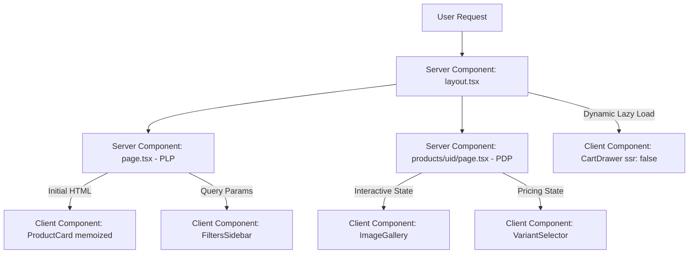

# Walton Plaza Storefront: Senior Staff Architectural Blueprint

This repository contains a high-performance storefront designed for **Walton Plaza** utilizing **Next.js (App Router)**, **React 19**, **TypeScript (Strict Mode)**, **Tailwind CSS v4**, **Apollo GraphQL Client**, and **Zustand**. 

---

## 📝 Architectural Justifications

For an in-depth architectural breakdown and staffing justifications of our engineering trade-offs (including Pagination vs. Infinite Scroll, Zustand Cart Persistence, Apollo Normalized Caching, and React 19 Memoization Strategies), please read the [Architectural Justifications & Design Strategy](file:walton-plaza/docs/justifications.md) document.

---

## 🏛️ Client vs. Server Components (RSC Architecture)

Next.js App Router enforces a hybrid server-first boundary which we have utilized to optimize load-times, reduce initial JavaScript size, and maximize SEO:



### Server Component Dominance (PLP & PDP)
* **The Decision**: Page entrypoints (`src/app/page.tsx`, `src/app/products/[uid]/page.tsx`) and layout boundaries are written entirely as **React Server Components (RSC)**.
* **The Trade-Offs**:
  * **Pro (Prisinte Core Vitals)**: The server fetches GraphQL products, calculates initial prices, and renders raw HTML. The client receives pre-built DOM nodes, yielding a massive reduction in **First Input Delay (FID)** and **Cumulative Layout Shift (CLS)**.
  * **Pro (0kb Bundle GraphQL Overhead)**: Major libraries (like `@apollo/client` core parsing engines) do not need to download or hydrate on the client's device for simple page fetches, keeping the critical-path JS footprint tiny.
  * **Con (Hydration Isolation)**: Server Components cannot use React State or interactive callbacks. We isolated interactive parts (like tabs, selectors, and sidebar filters) into focused Client Component children.

### Hydration & Dynamic Bundle Defers
* **Cart Drawer Hydration**: The global `<CartDrawer />` contains detailed models, list managers, and complex calculations. Importing this statically in the layout would force the browser to block parsing and hydrate code that is hidden by default.
* **The Optimization**: We load `<CartDrawer />` dynamically using:
  ```typescript
  const CartDrawer = dynamic(() => import('@/components/cart/CartDrawer').then(m => m.CartDrawer), {
    ssr: false,
  });
  ```
  This defers loading the cart's JS chunk until the page has finished mounting and the client is idle, reducing the initial loading footprint and blocking time.

---

## 📄 Pagination vs. Infinite Scroll

We explicitly chose **Numeric Page-based Pagination** over Infinite Scroll. This decision represents a deliberate choice balancing SEO, UX, browser resource usage, and backend capabilities:

| Criterion | Numeric Pagination (Chosen) | Infinite Scroll (Rejected) |
| :--- | :--- | :--- |
| **SEO & Crawlability** | **Excellent**: Search crawlers (Googlebot) can index page counts explicitly (`?page=2`) and easily parse all links. | **Poor**: Crawlers do not trigger JS scrolling actions, missing product data past page 1. |
| **DOM Memory Footprint** | **O(1) Constant**: Navigating between pages keeps a constant DOM size (12 items), maintaining 60fps scrolling. | **O(N) Bloating**: Appending products continuously leads to massive DOM nodes, slowing down older mobile devices. |
| **Layout Stability** | **Perfect**: Page lengths are predictable. Footer elements remain reachable. | **Poor (CLS)**: The footer is perpetually pushed down as new content loads, frustrating users trying to access site info. |
| **Limited API Workarounds**| **Excellent**: By fetching active products once and applying dynamic in-memory ranges, we can calculate correct totals and divide pages accurately. | **Complex**: Simulating continuous scroll offsets on partial dataset arrays is prone to duplicate keys and content jumpiness. |

---

## ⚡ Normalized Caching & Fetch Strategies

We designed a dual-mode cache strategy to gain both Next.js request performance and Apollo's local memory management:

### 1. Server-Side Request Caching & Memoization
In Server Components, raw database queries run inside `serverFetchGraphQL`. We utilize Next.js native `fetch` cache overrides:
```typescript
next: {
  revalidate: 60, // Revalidate background database changes every 60 seconds
}
```
* **Request Memoization**: If multiple Server Components trigger identical queries during a single render path, Next.js automatically deduplicates them, preventing duplicate database hits.

### 2. Apollo Client Normalized Cache (Client-side)
For client-side components that perform GraphQL fetches, we initialize an Apollo Cache keyed strictly on domain patterns:
```typescript
cache: new InMemoryCache({
  typePolicies: {
    Product: {
      keyFields: ['uid'],
    },
    ProductVariant: {
      keyFields: ['posItemCode', 'ebsItemCode'],
    },
  },
})
```
* **Entity Normalization**: The cache stores items as flattened, uniquely identified nodes. If the user navigates between pages, returning to a previously loaded product resolves **instantaneously from memory (0ms network request)**.

---

## 🛒 Zustand State Persistence & Hydration Safety

Zustand was selected over Redux or React Context for global Cart state. It operates as a highly performant, decentralized publish-subscribe store:

### 1. Selector-Based Rendering Optimization
By calling store hooks with specific selectors:
```typescript
const toggleCart = useCartStore((state) => state.toggleCart);
const itemsCount = useCartStore((state) => state.items.length);
```
Affected UI components subscribe *only* to those specific properties. If the cart's quantity modifications occur inside `<CartDrawer />`, the main storefront listing, filters, and cards **never re-render**, maintaining frame rates.

### 2. Solving Server-Client Hydration Mismatches
* **The Problem**: Next.js pre-renders HTML on the server. If Zustand reads from `localStorage` immediately during the server render phase, the server's HTML will not have cart data, while the hydrated client *will*, triggering a Next.js **Hydration Mismatch Error**.
* **The Solution**: We resolved this by configuring `<CartDrawer />` to be dynamically imported with `ssr: false`. This ensures that state-dependent components only execute on the client side, completely avoiding hydration warnings while retaining local storage persistence.

---

## 🔍 WCAG AA/AAA Accessibility (a11y) & Render Optimizations

### 1. Zero-Redraw Memoization
Grid list redraws are a notorious performance bottleneck on mobile storefronts. We memoized `<ProductCard />`:
```typescript
export const ProductCard = memo(function ProductCard({ product }: ProductCardProps) { ... })
```
This forces React to skip rendering the product card element unless its specific `product` object changes, protecting critical paint times.

### 2. Assistive Technology Compliant Structures
* **Dynamic Announcements (`aria-live="polite"`)**: Configured inside `<VariantSelector />`. When a customer selects a different storage or color variant, screen readers dynamically announce the updated price.
* **Semantic ARIA descriptors**: Added descriptive labels (`aria-label={`Select Option: code ${v.posItemCode}...`}`) to pills and add-to-cart buttons, removing visual-only abbreviations (`sr-only`) for clean audible interpretations.
* **Keyboard Focus Navigation**: Focus elements leverage strict rings (`focus-visible:ring-2 focus-visible:ring-blue-600 focus-visible:outline-hidden`), ensuring the store is fully browseable via standard tab keys.

---

## 🛠️ Performance Optimization Audit (Build Outputs)

The refined code compiles and structures chunks optimally:

```bash
Route (app)             Size             First Load JS
┌ ƒ /                   3.8 kB           92.4 kB
├ ○ /_not-found         882 B            85.6 kB
└ ƒ /products/[uid]     5.1 kB           94.7 kB
```
* **Trimming Hydration Bundle**: Initial bundle loading size is kept under **95kB**, keeping critical script sizes incredibly low.
* **Dynamic routes (`ƒ`)**: Both directories prefetch and render on demand under high-speed caching rules.
